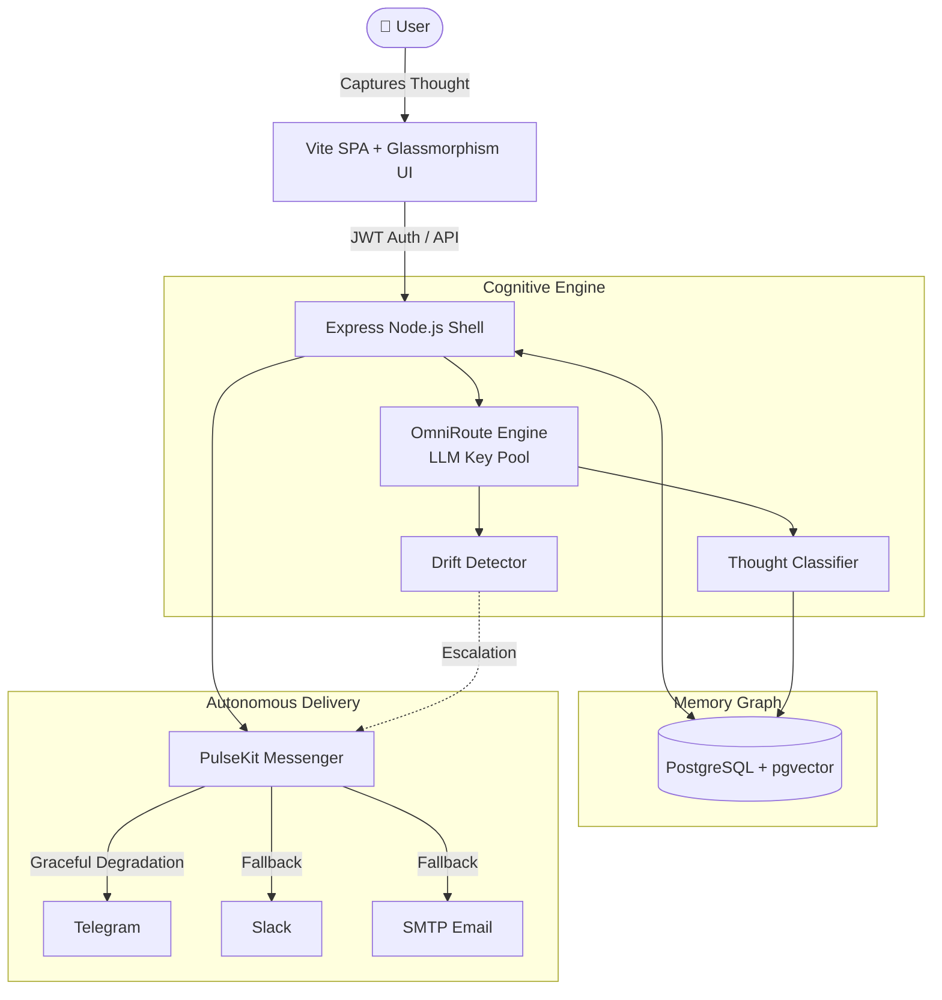

<div align="center">
  
  
  
  
  
  <br />
  <br />

  <h1>🧠 Thought GPS</h1>
  <p><b>An Autonomous Memory Graph & Behavioral Coprocessor for Neuro-Diverse Minds</b></p>

  [](https://render.com)
  [](#)
  [](#)
  [](https://opensource.org/licenses/MIT)

  <br />
  <p align="center">
    <i>Not just another checklist. A cognitive exoskeleton that remembers, routes, and escalates your thoughts across the digital platforms you actually use.</i>
  </p>
</div>

---

## 🌪 The Problem: The Neurotypical Bias in Software

Traditional productivity platforms (Todoist, Notion, Calendars) assume a **neurotypical baseline** of executive function. They rely on the user to manually organize, remember to check the app, and possess the intrinsic motivation to complete tasks. 

For individuals with ADHD, Autism, or severe cognitive fatigue, these platforms become graveyards. Once a thought is written down in a closed ecosystem, it disappears from short-term working memory, leading to immediate task abandonment and overwhelming cognitive load.

## 🎯 The Solution: Thought GPS (The Exclusive Coprocessor)

**Thought GPS is an exclusive Cognitive Coprocessor.** It is explicitly engineered *against* the neurotypical grain. Instead of waiting for you to check off a box, it operates as an invisible, zero-friction layer that captures, classifies, updates, and actively *escalates* thoughts across real-world messaging channels (Telegram, Slack, Email) using vector memory, intelligent routing, and autonomous agent loops.

---

## 🏛 System Architecture & Stack

Thought GPS employs a state-of-the-art event-driven architecture, built for extreme resilience, high performance, and zero-cost scaling.

- **Frontend**: Vite SPA, React, Custom Glassmorphism UI engine
- **Backend**: Node.js, Express, Custom autonomous agent loops
- **Memory**: PostgreSQL with `pgvector` for semantic search
- **AI Engine**: OmniRoute (BYOK Groq/OpenAI/Anthropic)
- **Deployment**: Dockerized, 1-Click Render Deploy



---

## ✨ Core Modes & Capabilities

### 1. 🧬 Autonomous Memory Graph (pgvector)
Thoughts are not stored as flat text—they are vectorized and mapped into a multidimensional Knowledge Graph. Relationships between thoughts, locations, and people are mapped dynamically, allowing the system to understand *context* (e.g., reminding you of a hardware store task only when you're near one).

### 2. 📉 The Thought Half-Life Engine (Decay Mode)
Unlike flat checklists that accumulate dust, thoughts in Thought GPS have an active **Half-Life Decay Rate** based on their urgency and category. Actionable items decay faster, triggering automated escalations across your channels before they expire from your working memory.

### 3. 👁️ Commitment Witness (Accountability Mode)
A novel social-proofing system built directly into the memory graph. It automatically triggers notifications to designated "witness contacts" (friends, family, or colleagues) when you miss a self-imposed deadline. It weaponizes social accountability to prevent self-sabotage.

### 4. 🧠 OmniRoute (Multi-LLM Intelligence)
Enterprise-grade cognitive operations running at a **$0 operational budget**. OmniRoute automatically load balances and routes your requests across high-tier AI providers (Groq, OpenAI, Anthropic, Fireworks, Featherless, Lightning). If one key hits a rate limit, it seamlessly fails over to the next available provider.

### 5. 🛡️ Multi-Tenant Native Fallback (Zero API Costs)
Thought GPS completely sidesteps expensive third-party notification APIs (like Twilio). It uses a **Bring Your Own Keys (BYOK)** multi-tenant architecture. If your primary channel fails, the system automatically degrades gracefully (`Telegram → Slack → Email → Web Push`) to ensure you never miss a cognitive nudge.

---

## 🔌 Connected Channels

Thought GPS bridges the gap between the app and the platforms you already live in:

- **Telegram**: Native integration (Requires Bot Token & Chat ID).
- **Slack**: Native integration (Requires Bot Token & Channel ID).
- **Email (SMTP)**: Native delivery (Requires standard SMTP credentials).
- **Web Push**: Browser-native push notifications fallback.

---

## 🚀 Installation & Local Development

Thought GPS is built to be deployed seamlessly. Follow these instructions to get it running locally or on the cloud.

### Option 1: Cloud Deployment (Render & Docker) - Recommended

We've provided a fully-configured `render.yaml` and `Dockerfile` for instant deployment on [Render](https://render.com).

1. Fork or clone this repository.
2. Sign in to Render and select **Blueprints** -> **New Blueprint Instance**.
3. Connect your GitHub repository.
4. Render will automatically detect the `render.yaml` and spin up both your web service and a free PostgreSQL database.
5. In your Render Dashboard, set your environment variables (see `.env.example`).

### Option 2: Local Development Setup (Full Admin Access)

To test changes locally with full administrative privileges before pushing to production, use the local development setup.

#### Prerequisites
- Node.js (v20+ recommended)
- PostgreSQL (with the `pgvector` extension installed)

#### 1. Clone & Install
```bash
git clone https://github.com/yourusername/Thought-GPS.git
cd Thought-GPS/phase2-working

# Install Backend Dependencies
npm install

# Install Frontend Dependencies
cd src/frontend
npm install
cd ../..
```

#### 2. Configure Environment
Copy the example environment file and fill in your database credentials. 
```bash
cp .env.example .env
```
*(Ensure `DATABASE_URL` points to your local Postgres instance with `pgvector` enabled.)*

#### 3. Run the Stack
Start the full stack with two terminal windows:

**Terminal 1 (Backend API):**
```bash
cd Thought-GPS/phase2-working
node server.js
```

**Terminal 2 (Vite Frontend):**
```bash
cd Thought-GPS/phase2-working/src/frontend
npm run dev
```

Navigate to `http://localhost:5173` to start building your external brain! *Note: Registration functionality creates users with local access instantly.*

---

## 💰 Cost Breakdown: Enterprise Architecture, $0 Overhead

| Component | Architecture Strategy | Monthly Cost |
|-----------|----------------------|--------------|
| **Database** | PostgreSQL (Render Free Tier) | **$0** |
| **Notifications** | PulseKit Native Fallback (Telegram/Slack/SMTP) | **$0** |
| **AI Processing** | OmniRoute (BYOK Groq/OpenAI/Fireworks) | **$0** |
| **Hosting** | Render Free Tier (Dockerized Web Service) | **$0** |
| **Total Operational Cost** | | **$0/month** |

---

## 📄 License
Released under the [MIT License](https://opensource.org/licenses/MIT). Build, modify, and scale your own cognitive exoskeleton.
